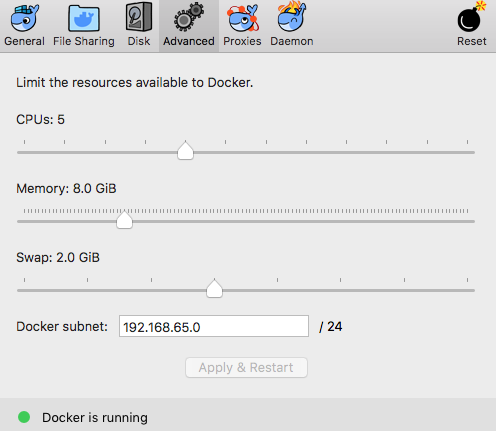
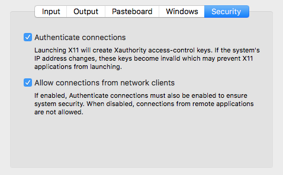

# HW1
Due by midnight 9/3.
 
## Install Required Software
- Sublime Text is a flexible text editor available for Mac, Linux and Windows. You'll use this to write scripts during your training. Sublime has nice features, but you are free to use any editor with some form of programming language support (e.g., Text Wrangler, emacs, kate, gedit, Notepad++ and many others). Relying on word processing programs, TextEdit or notepad is not acceptable. [Download](https://www.sublimetext.com/3)

- Docker provides reproducible software environments. [Download](https://store.docker.com/search?offering=community&type=edition). After installing Docker, run the Docker application. From the docker icon in the menu bar, select Preferences and adjust the available resources. Depending on your computer resources, you probably want to allow 4-8 GiB of memory and 2-4 CPUs. Click 'Apply & Restart'.



Finally, run 
```
docker pull rhancock/burc-lite
```
from your terminal to install the burc-lite container, which includes AFNI, FSL, and python.

- Git is a version control system to help you keep track of all your code and share with others. [Download](https://git-scm.com/book/en/v2/Getting-Started-Installing-Git)

- [Download Slack](https://slack.com/downloads/) and [join the course workspace](https://tinyurl.com/ibrainslack) to stay up to date.

- [Xquartz](https://www.xquartz.org) (for macOS). After installing, open Xquartz from the Applications/Utilities folder and open the preferences menu. On the security tab, check both boxes. This will allow graphical interfaces to be used in Docker.




- High performance computing
Neuroimaging analysis takes lots of computing time. You’ll want to run some of your analysis on the UConn Storrs HPC cluster, for which you’ll need to request an account cluster application form. You can find your advisor’s NetID at http://phonebook.uconn.edu


## Learn Bash
Work through the 4 free modules of [Learn the Command Line](https://www.codecademy.com/learn/learn-the-command-line) on Codeacademy. Don't just copy and paste commands in the lessons—type them out.

## Learn Git
Work through the 4 free modules of [Learn Git](https://www.codecademy.com/learn/learn-git) on Codeacademy.

## Assignment
In this assignment, you will write a shell script to automate a common neuroimaging task: creating a list of onset times for a task fMRI analysis.

1. [Fork](https://help.github.com/articles/fork-a-repo/) the [HW 1 repository](https://github.com/bircibrain/hw1) from the GitHub page.
2. Clone the repository to your computer using `git`
3. The file `stimuli.log` in the repository contains two columns separated by a space. The first specifies the time the trial started, the second specifies the experimental condition. Your job is to create a file for each condition containing only the times for that condition from the first column. You can use what you have learned about `cat`, pipes, `grep`, `sed`, and file redirection to do this, possibly in that order.
4. Organize your project with `scripts` and `data` directories.
4. Save your commands in a shell script file named `scripts/make_times.sh`. The file must start with the line
```
#!/bin/bash
```
5. The files created by your script should be named `data/<condition>.1d`, where `<condition>` comes from the second column, e.g. `data/Words.1d`
6. Finally, your `scripts/make_times.sh` file must be *executable*. You can do this by typing 
```
chmod 755 scripts/make_times.sh
```
7. Test your script by running `./scripts/make_times.sh` from the directory containing `stimuli.log`.
8. Using git, `commit` your project (remember to `git add` your files first). Make sure you do not remove any files that were in the original repository!
9. Using git, `push` your code to your forked repository.
10. On GitHub, [create a pull request](https://help.github.com/articles/creating-a-pull-request/) to submit your work.
11. After a few minutes, [check the status of your pull request](https://github.com/bircibrain/hw1/pulls). If you see a green check with the message 'All checks have passed' then you have successfully completed the homework! If not, there is an error in your script. Go back to step 4 and try again. I will also provide feedback by commenting on your pull request. You should get an email when this happens.


**Hint 1:** You need to remove the condition label in the second column, leaving only the numbers in the first column. You can do this using what you have learned about `sed` and the *regular expression* `.*` which means "match any character (`.`) zero or more times (`*`). The `sed` expression

```
sed -e "s/ .*//"
```

will strip the second column (the `awk` command provides a more convenient way to do this: `awk '{print $1}'`)

